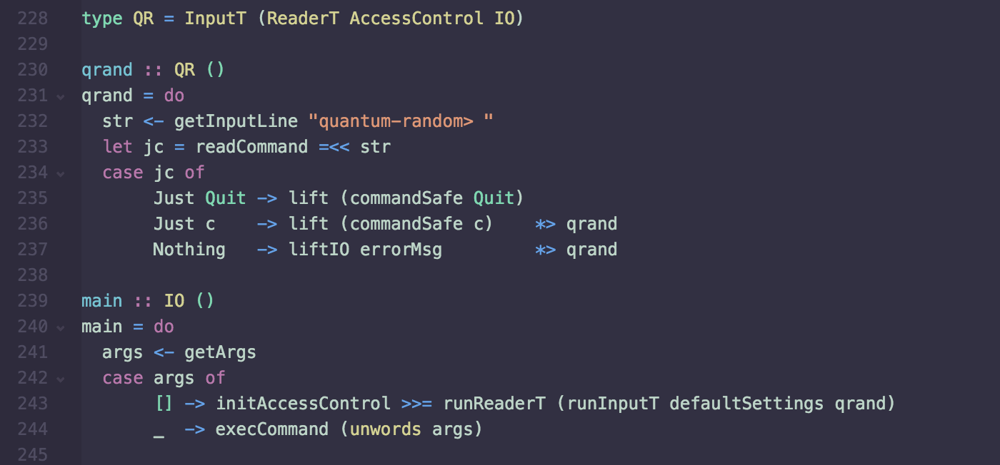

# Dark Condensate Syntax

A dark syntax theme for the [Atom editor](https://atom.io).

Subtle, cold and desaturated in character with emphasis on purple, mint, blue, yellow and orange.



It's been observed to work well in a variety of contexts, but feel free to send a language-specific PR (mainly in `styles/languages/`) if the color mapping for your language of choice can be improved. So far it's primarily shaped by my view as a Haskell developer.


### Installation

```
apm install dark-condensate-syntax
```
